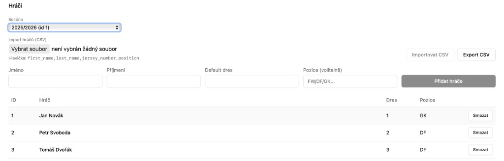
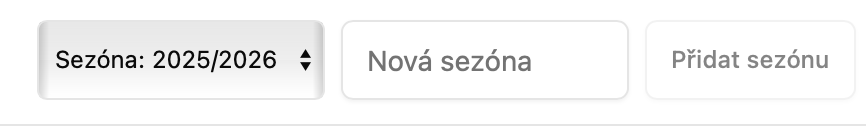
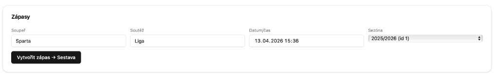
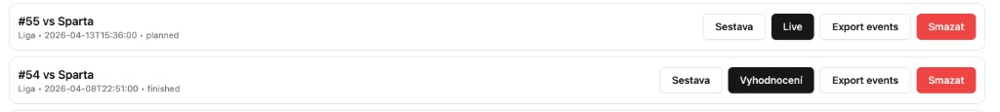
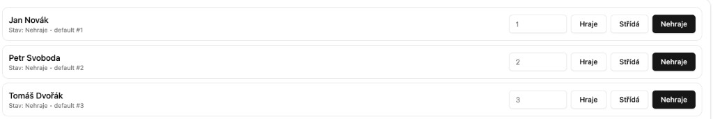
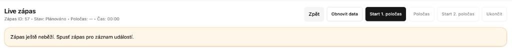
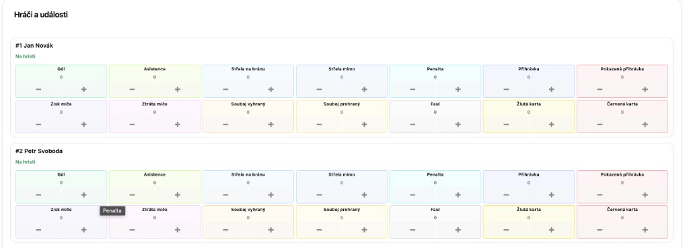
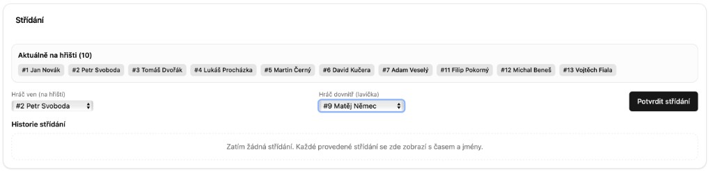
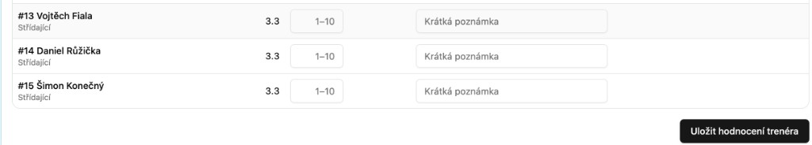

# 📘 Trainer App – Kompletní uživatelský manuál

---

## 1. Úvod

**Trainer App** je webová aplikace určená pro trenéry, asistenty a realizační týmy sportovních klubů.  
Slouží ke kompletní správě zápasu – od přípravy sestavy až po detailní analýzu výkonu hráčů a týmu.

Hlavní přínosy aplikace:
- umožňuje **rychlý a intuitivní zápis událostí během zápasu**,
- zaznamenává **přesný čas každé akce**,
- poskytuje **automatické statistiky a analytiku**,
- zjednodušuje práci trenéra v reálném čase.

Aplikace je navržena tak, aby byla použitelná přímo během utkání – bez zdržování a bez složitého ovládání.

---

## 2. K čemu aplikace slouží

Trainer App pokrývá celý proces práce se zápasem:

###  Před zápasem
- správa hráčů (ručně nebo importem),
- vytvoření zápasu,
- příprava sestavy a rolí hráčů.

###  Během zápasu
- live zapisování událostí,
- evidence střídání,
- řízení času zápasu.

###  Po zápase
- uzavření zápasu,
- hodnocení hráčů,
- statistiky a analytika.

---

## 3. Co aplikace umožňuje

Z pohledu běžného uživatele aplikace umožňuje:
- [spravovat hráče](#sprava-hracu),
- [vytvářet zápasy](#vytvoreni-zapasu),
- [připravovat sestavu](#priprava-sestavy),
- [zapisovat live statistiky (+ / -)](#zapisovani-udalosti),
- [provádět střídání](#stridani),
- [ukončit zápas](#ukonceni-zapasu),
- [vyhodnotit hráče](#hodnoceni-hracu),
- [číst statistiky a analytiku](#statistiky-a-analytika).

---

## 4. Co je potřeba před začátkem

Pro používání aplikace potřebujete:
- na webovém prohlížeci přejít na adresu https://bakalarska-1.onrender.com/
- webový prohlížeč (doporučeno: Chrome, Edge, Safari),
- přístupové údaje (přihlášení),
- internetové připojení.

### Přihlášení

Můžete použít:
- **výchozí (defaultní) přihlášení** pro demo provoz (pokud je dostupné),
- nebo **vlastní e-mail a heslo** přidělené klubem/správcem.

Demo přihlášení (pokud je aktivní):
- Trenér: `coach@demo.local` / `coach`
- Asistent: `assistant@demo.local` / `assistant`

Doporučení:
- ideální zařízení: **tablet nebo notebook**,
- orientace: **na šířku (landscape)**,
- mobil není ideální pro live zápis, kvůli velikosti.

---

## 5. Jak začít

Doporučený postup práce:

1. **Adresa https://bakalarska-1.onrender.com
2. **Hráči**
3. **Zápasy**
4. **Sestava**
5. **Live zápas**
6. **Vyhodnocení / Analytika**

Tento postup odpovídá reálnému průběhu zápasu a minimalizuje chyby.

---

<a id="sprava-hracu"></a>
## 6. Sekce Hráči (Players)

Tato sekce slouží ke správě soupisky týmu.

### Co zde můžete dělat
- přidávat nové hráče,
- mazat hráče,
- importovat hráče z CSV,
- exportovat hráče,
- kontrolovat aktuální soupisku,
- přepínat sezónu hráčů.

### [Obrázek: Sekce Hráči]


Na obrazovce vidíte:
- výběr sezóny nahoře,
- formulář pro ruční přidání hráče,
- část pro import/export CSV,
- tabulku všech hráčů,
- tlačítko **Smazat** u jednotlivých hráčů.

### 6.1 Změna sezóny (důležité)

V horní části sekce Hráči je rozbalovací pole **Sezóna**.



Postup:
1. Klikněte na pole **Sezóna**.
2. Vyberte požadovanou sezónu.
3. Tabulka hráčů se přepne na data z vybrané sezóny.

Používejte to vždy, když přecházíte mezi ročníky.

### 6.2 Přidání hráče ručně

Vyplňte:
- jméno,
- příjmení,
- číslo dresu,
- pozici (volitelné).

Klikněte na **Přidat hráče**.

### 6.3 Smazání hráče

- V tabulce klikněte na **Smazat** u konkrétního hráče.

### 6.4 Import hráčů (CSV)

1. Klikněte na **Vybrat soubor**.
2. Vyberte CSV soubor.
3. Klikněte na **Importovat CSV**.

Použijte CSV soubor ve formátu:

```csv
first_name,last_name,jersey_number,position
Jan,Novák,1,GK
Petr,Svoboda,2,DF
Tomáš,Dvořák,3,MF
```

Platí:
- jméno, příjmení a číslo dresu jsou povinné,
- pozice je volitelná.

---

## 7. Sekce Zápasy (Matches)

Tato sekce slouží k práci se zápasy.

### [Obrázek: Sekce Zápasy]




<a id="vytvoreni-zapasu"></a>
### 7.1 Vytvoření zápasu

Vyplňte:
- soupeř,
- soutěž,
- datum a čas,
- sezóna.

Klikněte na:
➡️ **Vytvořit zápas**

Po vytvoření:
➡️ automaticky přecházíte na sestavu.

### 7.2 Práce s existujícím zápasem



U každého zápasu:
- **Sestava** → příprava před zápasem,
- **Live** → průběh zápasu,
- **Report** → vyhodnocení.

### 7.3 Změna sezóny u zápasů

Při vytváření zápasu vždy zkontrolujte pole **Sezóna**.

Doporučení:
- nový zápas zakládejte do správné sezóny hned,
- předejdete tím míchání statistik mezi ročníky.

---

<a id="priprava-sestavy"></a>
## 8. Sestava před zápasem

Zde určujete, kdo nastoupí do zápasu.

### [Obrázek: Sekce Sestava]




### 8.1 Role hráčů
- **Hraje** → základní sestava,
- **Střídá** → lavička,
- **Nehraje** → mimo zápas.

### 8.2 Postup
1. nastavte role hráčů,
2. zkontrolujte čísla dresů,
3. klikněte na **Uložit**,
4. klikněte na **Přejít na Live**.

💡 Tip: vždy zkontrolujte sestavu před začátkem zápasu.

---

## 9. Live zápas – nejdůležitější část

Tato sekce se používá během zápasu v reálném čase.


### 9.1 Spuštění zápasu


- klikněte na **Start 1st Half**,
- čas začne běžet od `00:00`.

### 9.2 Čas zápasu
- běží pouze při aktivním zápase,
- zastavuje se v poločase,
- pokračuje ve 2. poločase.

<a id="zapisovani-udalosti"></a>
### 9.3 Zapisování událostí


Každý hráč má vlastní řádek.

Ovládání:
- **+** → přidání události
- **−** → odebrání poslední události

Praktické použití:
- zapisujte okamžitě při akci,
- nečekejte na konec poločasu,
- chyby opravujte ihned.

### 9.4 Poločas
- klikněte na **Half-Time**,
- čas se zastaví,
- zapisování se pozastaví.

### 9.5 Druhý poločas
- klikněte na **Start 2nd Half**,
- čas pokračuje.

<a id="stridani"></a>
### 9.6 Střídání


Postup:
1. vyberte hráče dolů,
2. vyberte hráče nahoru,
3. potvrďte.

Výsledek:
- aktualizace sestavy,
- uložení času střídání,
- hráč mimo hřiště už nemá události.

<a id="ukonceni-zapasu"></a>
### 9.7 Ukončení zápasu
- klikněte na **Finish Match**,
- zápas se uzavře,
- přechod do reportu.

---

## 10. Po zápase

Po ukončení zápasu můžete:
- otevřít vyhodnocení/report,
- zkontrolovat souhrn zápasu,
- doplnit hodnocení hráčů.

Obvyklý další krok:
➡️ projít data ještě hned po zápase, dokud máte utkání v paměti.

---

<a id="hodnoceni-hracu"></a>
## 11. Hodnocení hráčů

Po zápase můžete hodnotit hráče v sekci Evaluation.


### [Obrázek: Hodnocení hráčů]

**[Obrázek: Hodnocení hráčů]**

Možnosti:
- známka 1–10,
- textová poznámka,
- úprava hodnocení.

Důležité:
- hodnocení je volitelné,
- pokud není zadáno, použije se automatické hodnocení systému.

---

<a id="statistiky-a-analytika"></a>
## 12. Statistiky a analytika

Sekce: **Report / Analytics**

### [Obrázek: Statistiky a analytika]

**[Obrázek: Statistiky a analytika]**

Co obsahuje:
- týmové statistiky,
- individuální statistiky,
- grafy průběhu zápasu,
- přehled výkonu hráčů.

Jak to číst:

**Grafy**
- ukazují vývoj zápasu v čase,
- pomáhají identifikovat silné/slabé části.

**Tabulky**
- přesná čísla pro každého hráče,
- rychlé porovnání výkonu.

Co z toho získáte:
- kdo byl nejlepší hráč,
- kdy byl tým nejsilnější,
- kde vznikaly chyby.

---

## 13. Praktické tipy

- používejte tablet (landscape),
- zapisujte události ihned,
- opravujte chyby okamžitě,
- po zápase zkontrolujte data.

---

## 14. Důležité poznámky

- coach rating je volitelný,
- analytika závisí na kvalitě zápisu,
- aplikace je navržena pro jednoduché a rychlé použití při reálném zápase.

---

## 15. Rychlý přehled workflow

1. Přihlášení  
2. Správa hráčů  
3. Vytvoření zápasu  
4. Sestava  
5. Live zápas  
6. Zápis událostí  
7. Ukončení zápasu  
8. Vyhodnocení a analytika

